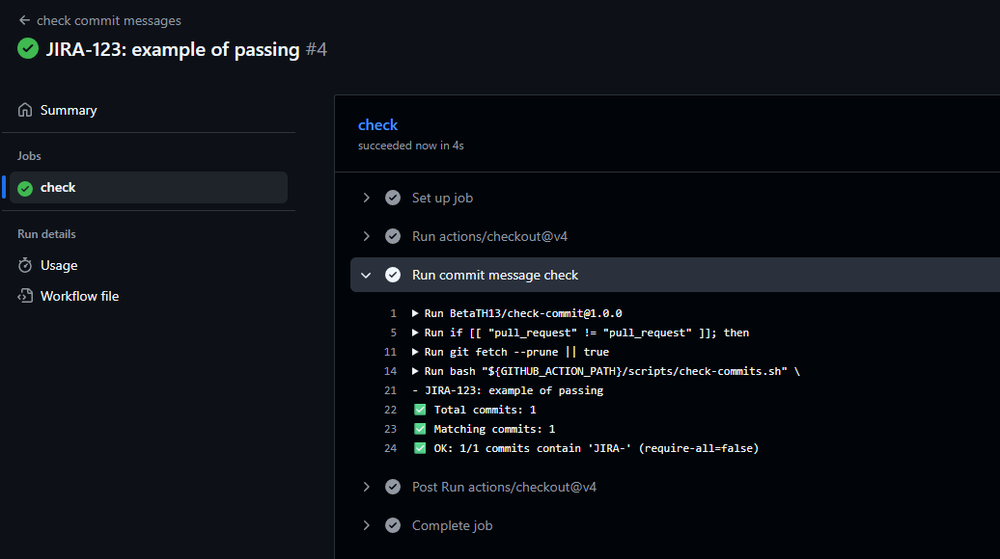
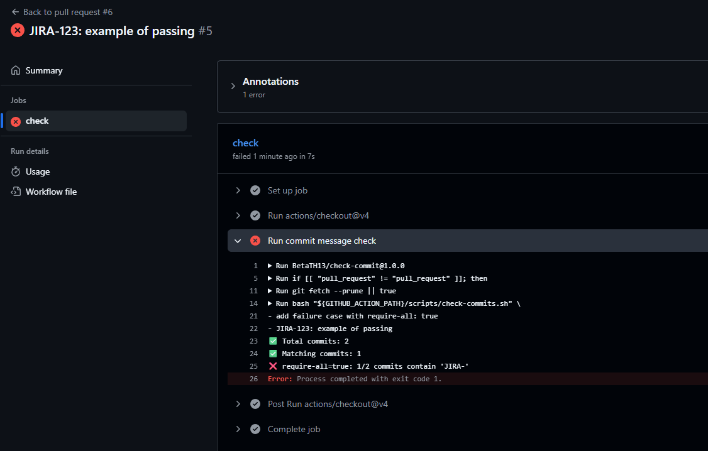
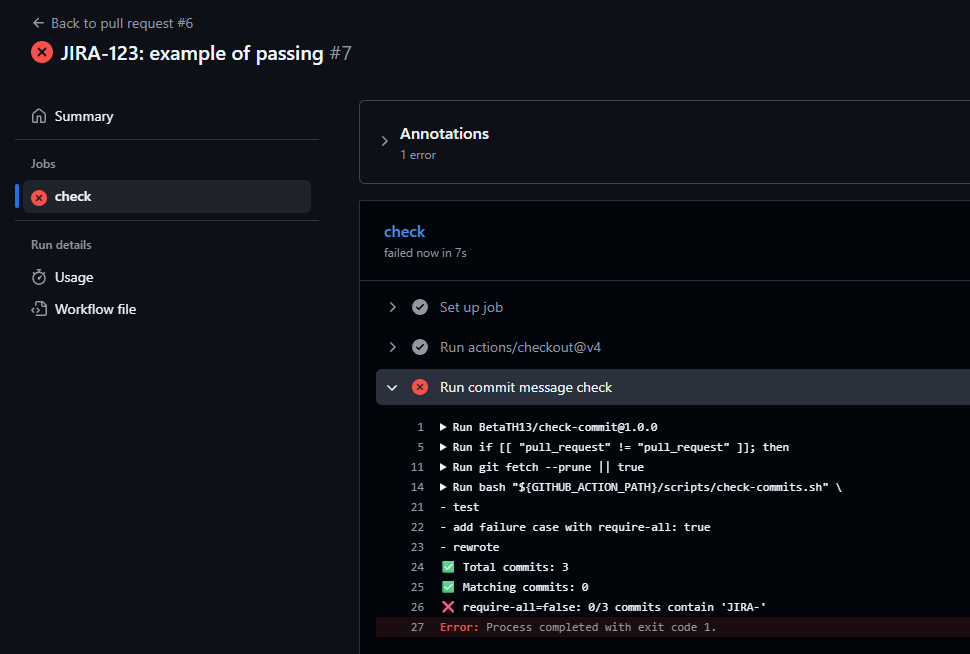

# check-commit-messages

GitHub Action to validate commits messages in pull requests.
Checks if commits contains a specific keyword.
By default if **atleast one commit** contains the keyword the actions passes.
There is an option to require all commits to contain the keyword.

## Examples

### Action passed sucessfully



Above is an example where the action passed. 

### Action failed require-all is set true



Above is an example where the action failed because only 1/2 commits contain the keyword `JIRA-`

### Action failed require-all is set to false 




## Usage

An example on how to use this action in your workflows can be found under.

```yaml
name: check commit messages

on:
  pull_request:
    branches: [master]

jobs:
  check:
    runs-on: ubuntu-latest
    steps:
      - uses: actions/checkout@v4
        with:
          fetch-depth: 0

      - name: Run commit message check
        uses: BetaTH13/check-commit@1.0.0
        with:
          keyword: "JIRA-"
          # optional defaults to false
          require-all: "true"
```

## Inputs

| Name        | Required | Description                                                                                                                       |
| ----------- | -------- | --------------------------------------------------------------------------------------------------------------------------------- |
| keyword     | Yes      | The keyword which needs to be contained in the commit message                                                                     |
| require-all | No       | If  `"false"` only 1 commit needs to containt the commit message. If `"true"` all commit messages must contain the keyword |

## Issues

Found a bug or have a feature request?
Please open an issue on the repository.
